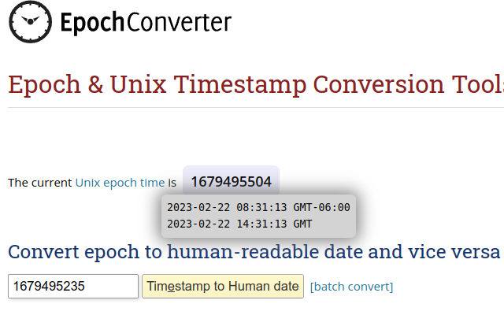
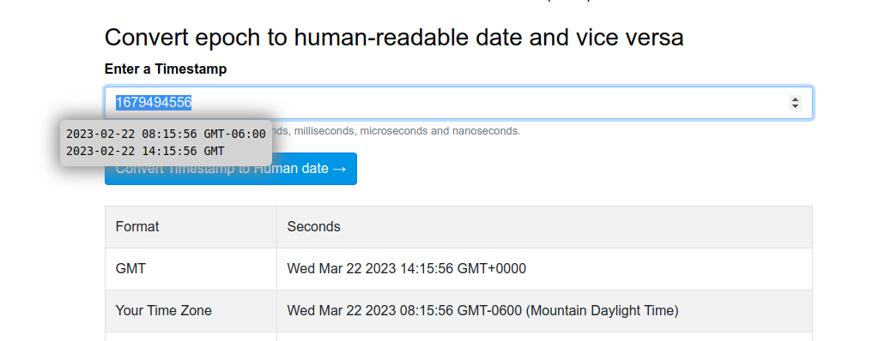

Epoch Converter
===============

A simple Chrome extension to help translate Unix timestamps (seconds, milliseconds, or microseconds since the epoch) to human-readable dates.

Works by selecting text on any page, or by hovering over an element whose text is a numeric epoch timestamp. Timestamps of 10 digits (seconds), 13 digits (milliseconds), and 16 digits (microseconds) are all supported.

Available on the [Chrome Web Store][1].

## Installation

### From the Chrome Web Store

Install directly from the [Chrome Web Store][1] – no extra steps required.

### Manual installation (developer / unpacked)

1. Clone or download this repository.
2. Open Chrome and navigate to `chrome://extensions/`.
3. Enable **Developer mode** (toggle in the top-right corner).
4. Click **Load unpacked** and select the folder that contains `manifest.json`.
5. The extension is now active on all pages.

[1]: https://chrome.google.com/webstore/detail/epoch-converter/plfbhieilacgkdnphcdehdnhjenmnima?hl=en&authuser=0
